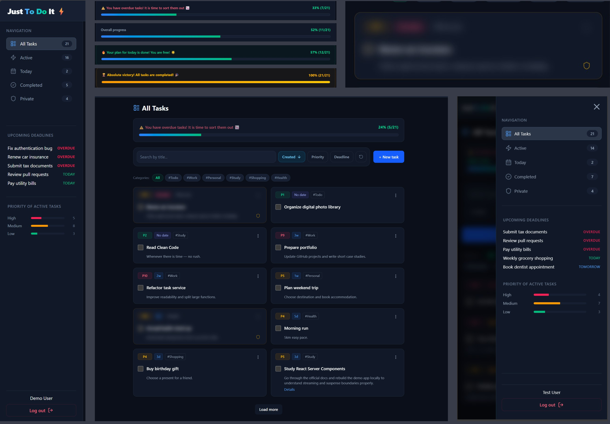

# Just To Do It ⚡

A modern task management application built with **Next.js**, **Express**, and **MongoDB**. Organize tasks with priorities, deadlines, categories, private visibility, and an interactive dashboard designed to keep productivity on track.

<p align="center">
  
</p>

**🌐 Live Demo:** [Just To Do It](https://to-do-list-frontend-dusky.vercel.app)

## 🔐 Demo Account

You can use the following credentials to explore the application:

**Email:** demo@example.com  
**Password:** 12345678

The demo account already contains sample tasks to showcase filtering, sorting, priorities, dashboard statistics, and other features.

**📦 Frontend Repository:** [to-do-list-frontend](https://github.com/Viacheslav-Bo/to-do-list-frontend)  
**🔗 Backend Repository:** Node.js, Express, TypeScript, MongoDB, Mongoose, JWT Authentication  
See the separate backend repository:
[to-do-list-backend](https://github.com/Viacheslav-Bo/to-do-list-backend)

---

# ✨ Features

## Core Features

- User authentication with JWT stored in **httpOnly cookies**
- Create, edit, delete, and complete tasks
- Search tasks by title (debounced)
- Sort tasks by priority, creation date, or deadline (ascending/descending)
- Filter by status, category, due today, and private tasks
- Priority levels (1–10) with color-coded badges

## Advanced Features

- Private tasks that are fully hidden and non-interactive when Privacy Mode is enabled
- Custom-built category selector with no external dependency, and a styled date picker (react-day-picker) with a hand-rolled dropdown trigger instead of a UI library popover
- Infinite pagination with **Load More**
- Dashboard with progress overview, upcoming deadlines, and active task statistics
- Light and dark themes with persistent user preference
- Password visibility toggle
- Toast notifications for key user actions
- Global loading and error handling
- Fully responsive layout (320px mobile to 4K displays)
- Secure authentication configured for both local development and production deployments
- End-to-end testing with Playwright

---

# 🛠 Tech Stack

| Category                  | Technology                                    |
| ------------------------- | --------------------------------------------- |
| **Frontend**              | Next.js 16 (App Router), React 19, TypeScript |
| **Styling**               | Tailwind CSS v4                               |
| **Data Fetching**         | TanStack React Query v5                       |
| **State Management**      | Zustand                                       |
| **HTTP Client**           | Axios                                         |
| **Forms & Notifications** | react-hot-toast                               |
| **Date Handling**         | react-day-picker, date-fns                    |
| **Icons**                 | lucide-react                                  |
| **Testing**               | Playwright                                    |

**Backend:** Node.js, Express, MongoDB (see the separate backend repository).

---

# 🚀 Getting Started

## Prerequisites

- Node.js 20+
- Running backend API (locally or deployed)

## Installation

```bash
git clone <repository-url>
cd to-do-list-frontend
npm install
```

## Environment Variables

Create a `.env.local` file in the project root:

```env
NEXT_PUBLIC_API_URL=http://localhost:3000
```

Set the value to your backend API URL.

## Run the Development Server

```bash
npm run dev
```

The application will be available at:

```
http://localhost:3001
```

## Production Build

```bash
npm run build
npm run start
```

---

# 🧪 Running Tests

Playwright tests run against the local development environment.

Start the backend:

```bash
docker compose up
```

Run the test suite:

```bash
npx playwright test
```

Run tests in headed mode:

```bash
npx playwright test --headed
```

See the [`e2e`](./e2e) directory for the test suite.

---

# 📜 Available Scripts

| Command               | Description                  |
| --------------------- | ---------------------------- |
| `npm run dev`         | Start the development server |
| `npm run build`       | Create a production build    |
| `npm run start`       | Start the production server  |
| `npm run lint`        | Run ESLint                   |
| `npx playwright test` | Execute the E2E test suite   |

---

# ☁️ Deployment

- **Frontend Hosting:** Vercel  
  Demo: https://to-do-list-frontend-dusky.vercel.app

- **Backend Hosting:** Render  
  API: https://to-do-list-backend-3-nwmt.onrender.com

Before deploying, configure the `NEXT_PUBLIC_API_URL` environment variable in Vercel. Since Next.js embeds `NEXT_PUBLIC_*` variables during the build process, updating the value later requires a new deployment.

---

## 📂 Project Structure

```text
src
├── app
│   ├── (auth)
│   │   ├── auth
│   │   │   ├── login
│   │   │   ├── register
│   │   │   └── logout
│   │   └── layout.tsx
│   │
│   ├── (dashboard)
│   │   ├── tasks
│   │   └── layout.tsx
│   │
│   ├── layout.tsx
│   ├── loading.tsx
│   ├── error.tsx
│   ├── not-found.tsx
│   └── page.tsx
│
├── components
│   ├── layout
│   │   ├── Header
│   │   ├── Footer
│   │   ├── Navigation
│   │   ├── SideBar
│   │   ├── BurgerMenu
│   │   ├── MiniProfile
│   │   └── PrivacyToggle
│   │
│   ├── Tasks
│   │   ├── TaskForm
│   │   ├── TaskItem
│   │   ├── TasksList
│   │   ├── TasksToolbar
│   │   ├── ProgressSection
│   │   ├── PriorityBreakdown
│   │   └── UpcomingDeadlines
│   │
│   ├── ui
│   │   ├── Button
│   │   ├── Input
│   │   ├── Modal
│   │   ├── Spinner
│   │   ├── DatePicker
│   │   └── Textarea
│   │
│   ├── Categories
│   ├── Filters
│   └── providers
│
├── hooks
│   └── tasks
│
├── lib
│   ├── api
│   └── store
│
├── constants
├── types
└── globals.css
```

---

# 👤 Author

**Viacheslav Bo**

Full Stack Developer

- GitHub: https://github.com/Viacheslav-Bo
- LinkedIn: https://linkedin.com/in/viacheslav-bobivnyk
